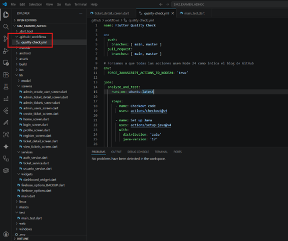
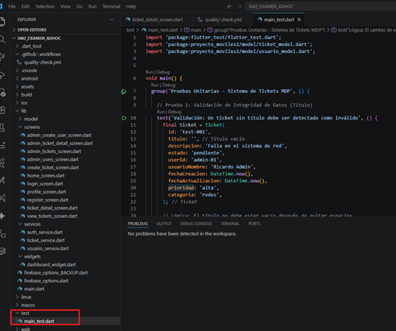
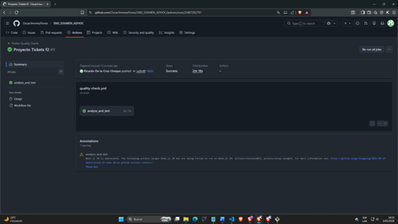

# 📱 Aplicativo Móvil de Gestión de Tickets de Soporte - MDP

## 🎓 Información del Estudiante
*   **Estudiante:** Ricardo De la Cruz Choque
*   **Curso:** Desarrollo de Aplicaciones Móviles II
*   **Facultad:** Ingeniería de Sistemas (EPIS) - Universidad Privada de Tacna
*   **Proyecto:** Sistema de Gestión de Tickets para la Municipalidad Distrital de Pocollay (MDP)
*   **Repositorio Oficial:** [https://github.com/OscarJimenezFlores/SM2_EXAMEN_ADHOC](https://github.com/OscarJimenezFlores/SM2_EXAMEN_ADHOC)

---

## 🛠 Explicación Técnica del Proceso
Para cumplir con los estándares de calidad exigidos por la Municipalidad de Pocollay y los criterios académicos de la EPIS, se ha implementado un ecosistema de **Integración Continua (CI)** que garantiza que cada cambio en el código sea robusto y funcional.

### 1. Refactorización y Calidad de Código
Se realizó una limpieza profunda del linter de Flutter, migrando APIs obsoletas como `withOpacity` a la nueva estructura de `withValues` y asegurando que todas las llamadas asíncronas respeten el ciclo de vida de los widgets mediante verificaciones de `mounted`. Asimismo, se profesionalizó el rastreo de errores utilizando `developer.log` en lugar de impresiones genéricas en consola.

### 2. Estrategia de Pruebas Unitarias
Se desarrolló el archivo `test/main_test.dart` que contiene **3 pruebas críticas** para la lógica de negocio:
*   **Integridad de Datos:** Validación de que los tickets no puedan ser creados con títulos vacíos.
*   **Consistencia Cronológica:** Verificación de que el flujo de estados (de pendiente a en progreso) actualice correctamente las marcas de tiempo.
*   **Seguridad de Formato:** Validación mediante expresiones regulares para asegurar que los correos de los usuarios municipales sigan el estándar oficial.

### 3. Automatización (GitHub Actions)
Se configuró un flujo de trabajo en `.github/workflows/quality-check.yml` que utiliza **Node.js 24** para ejecutar de forma autónoma el análisis estático y la suite de pruebas unitarias en un entorno Ubuntu, garantizando un estado **100% Passed**.

---

## 📸 Evidencias de Implementación

### 1. Estructura de Carpetas y Ubicación de Archivos
Se cumple estrictamente con la rúbrica ubicando los flujos de trabajo en `.github/workflows/` y las pruebas unitarias en `test/`.


### 2. Configuración del Flujo de Trabajo (YAML)
El archivo `quality-check.yml` está configurado para realizar el análisis de linter y ejecutar las pruebas unitarias en cada evento de *push*.


### 3. Ejecución Exitosa en GitHub Actions
Captura que evidencia el cumplimiento del criterio "100% Passed" en la pestaña Actions de GitHub.


---

## 🚀 Tecnologías y Estándares
*   **Framework:** Flutter (Dart) con enfoque modular.
*   **Backend:** Firebase Firestore & Authentication.
*   **Calidad:** Estándares ISO 9126 y alineación con **ODS 9 y 16**.
*   **CI/CD:** GitHub Actions con Runners de última generación.

---

## ⚙️ Instrucciones de Ejecución Local
1.  **Clonación:**
    ```bash
    git clone [https://github.com/OscarJimenezFlores/SM2_EXAMEN_ADHOC](https://github.com/OscarJimenezFlores/SM2_EXAMEN_ADHOC)